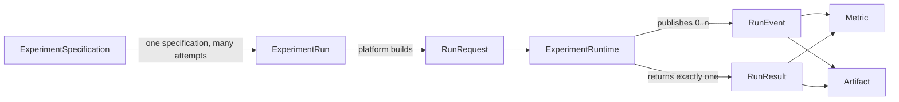

# PaperReproAgent Domain Model

## 1. Purpose

Task 02 defines the provider-neutral vocabulary shared by future paper parsing,
planning, job orchestration, runtimes, APIs, persistence and UI layers. These
models contain validation only: they do not clone repositories, download data,
upload artifacts, open files or start experiments.

Task 03 adds the preceding paper-semantic `ReproductionSpecification` layer.
See [`REPRODUCTION_SPEC.md`](REPRODUCTION_SPEC.md) for its provenance, claims,
unknown information and one-to-many experiment planning boundary.



## 2. Model responsibilities

| Model | Responsibility | Explicitly not responsible for |
|---|---|---|
| `ExperimentSpecification` | Reusable definition of what to run: intent, sources, command, environment, parameters and expected metrics | Run lifecycle, worker allocation, persistence |
| `ExperimentRun` | State of one concrete attempt linked by `experiment_id` | Defining the reusable experiment |
| `RunRequest` | Self-contained, database-independent input admitted to a runtime | ORM entities or runtime implementation details |
| `RunEvent` | Timestamped progress record with event-specific typed payload | WebSocket, SSE, database or logging transport |
| `Metric` | Structured observed numeric value, optionally scoped by step and split | Comparing results with paper claims |
| `Artifact` | Typed URI and metadata referencing an output | File IO, upload or artifact storage |
| `RunResult` | One terminal runtime outcome with metrics, artifacts and failure details | Curie/LangGraph-specific state |

Supporting value objects include `RepositorySource`, `DatasetSource`,
`EnvironmentSpecification`, `ResourceRequest`, `RuntimeOptions`,
`MetricExpectation` and `RunError`.

## 3. Specification versus run

`ExperimentSpecification` answers **what should be executed**. It is reusable
and can represent a full reproduction, ablation, baseline or custom experiment.

`ExperimentRun` answers **what happened during one attempt**. Multiple runs can
reference the same specification, use different attempts or runtimes, and move
independently through their lifecycle.

The lifecycle is intentionally small:

`PENDING -> QUEUED -> PREPARING -> RUNNING -> SUCCEEDED | FAILED | CANCELLED`

No paused, retrying or provisioning states are added yet. Retry is represented
by a new `ExperimentRun.attempt`, while preparation covers source/environment
setup until real scheduler requirements justify finer states.

## 4. Concrete reproduction example

Paper: **DMSF**  
Target: **MVSA-S Full Model**  
Expected test accuracy: **0.7533**  
Expected test F1: **0.7531**

```python
from backend.app.domain import (
    DatasetSource,
    ExperimentSpecification,
    ExperimentTaskType,
    MetricExpectation,
    RepositorySource,
)

specification = ExperimentSpecification(
    id="dmsf-mvsa-s-full",
    name="DMSF MVSA-S Full Model",
    description="Reproduce the full DMSF model on the MVSA-S dataset.",
    task_type=ExperimentTaskType.FULL_REPRODUCTION,
    repository=RepositorySource(
        uri="https://github.com/example/dmsf.git",
        revision="paper-release",
    ),
    dataset=DatasetSource(uri="dataset://mvsa-s", name="MVSA-S"),
    entrypoint="train.py",
    command=("python", "train.py", "--dataset", "MVSA-S"),
    hyperparameters={"epochs": 30, "batch_size": 32},
    expected_metrics=(
        MetricExpectation(name="accuracy", value=0.7533, split="test"),
        MetricExpectation(name="f1", value=0.7531, split="test"),
    ),
    seed=42,
    tags=("dmsf", "full-model"),
)
```

This value can later produce many `ExperimentRun` records without copying run
status or timestamps back into the specification.

## 5. Event model

`RunEvent` always contains `run_id`, `event_type`, an aware timestamp and a
typed payload. The MVP event set is:

| Event type | Payload |
|---|---|
| `RUN_STARTED` | `RunStartedPayload` |
| `RUN_STATUS_CHANGED` | `StatusChangedPayload` |
| `AGENT_STARTED`, `AGENT_FINISHED` | `AgentEventPayload` |
| `LOG` | `LogPayload` |
| `METRIC` | `Metric` |
| `ARTIFACT_CREATED` | `Artifact` |
| `RUN_FINISHED`, `RUN_FAILED` | `RunTerminalPayload` |

The model validates event/payload compatibility. Transport adapters can later
send exactly the same events to a console, database, WebSocket or SSE stream.
Runtime code only depends on `RunEventSink.publish(event)`.

## 6. Runtime contract

`ExperimentRuntime.run(request, event_sink) -> RunResult` is a structural Python
`Protocol`. Platform code sees only this interface and the domain models. It
does not know about Architect, Technician, LangGraph, OpenHands or Docker.

`InMemoryEventSink` is the Task 02 implementation used for deterministic unit
tests. It returns immutable snapshots in publication order and performs no IO.

`CurieRuntimeAdapter` currently translates `RunRequest` into the minimal
`CurieRuntimeInput` seam. Its `run` method deliberately raises
`NotImplementedError`: connecting the retained workflow safely requires later
work on Docker/OpenHands/global-state assumptions. The adapter does not emit
fake success events or return a fake production result.

## 7. Source traceability

The extracted Curie Core originated from
[Just-Curieous/Curie](https://github.com/Just-Curieous/Curie) at commit
`db1b1f56159b591515f77e03c55bf473d5c1c201`. Git history independence does not
remove the upstream license or attribution obligations recorded in the root
`LICENSE` and project documentation.
