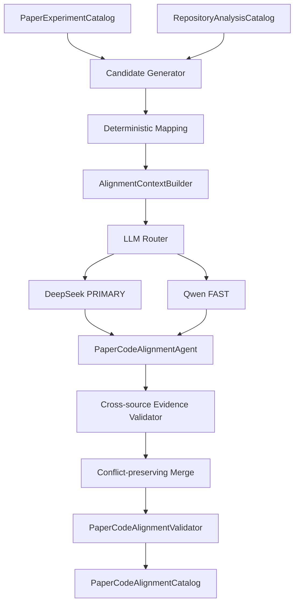

# 论文—代码对齐

Task 07 消费经过验证的 `PaperExperimentCatalog` 与 `RepositoryAnalysisCatalog`，输出绑定论文身份、repository snapshot 和 resolved commit 的 `PaperCodeAlignmentCatalog`。它只报告对应、一致、缺失、歧义与冲突，不选择最终命令、不解析最终环境，也不生成 `ExperimentSpecification`。

## Catalog 与映射模型

- `ExperimentAlignmentRecord`：论文实验与一个或多个 repository implementation 的关系，并引用 entrypoint、config、已有 command、参数/数据集/模型/消融/指标 mapping ID。
- `DatasetAlignment`、`ModelAlignment`：保留原名、repository component ID、双源证据、状态、reasoning 和 heuristic confidence。
- `ParameterAlignment`：区分 `MATCHED`、语义相同但值未知、值冲突、paper-only、repository-only、ambiguous 和 not-found；repository 值不会被改写为论文明确值。
- `AblationAlignment`：必须指向真实 flag、zero weight、config、variant 或其它 Task 06 已提取机制。
- `MetricAlignment`：比较 metric identity、split/aggregation；例如 weighted F1 与 macro F1 会形成冲突。
- `AlignmentConflict`：覆盖参数值、缺失实现、多实现、metric 定义、dataset、model variant、README/code 等少量稳定类型。PRIMARY 可以提出 recommendation，但只有确定性等价规则能够自动标记 `RESOLVED`。

状态不是布尔值：`ALIGNED` 表示关键组成有可靠对应；`PARTIALLY_ALIGNED` 表示存在关键缺口；`AMBIGUOUS` 保留多个合理候选；`NOT_FOUND` 是成功确定不存在可信实现；`CONFLICTED` 表示对应关系存在但有影响复现的矛盾。

## Deterministic first 与 confidence

`AlignmentCandidateGenerator` 保守规范化原名和 aliases，利用 dataset/model/variant、parameter、config、script/path 和 implementation 关系生成每个 paper item 的有限候选。字面值比较、数值等价、参数冲突与稳定 ID 均由确定性代码完成。

Repository component 与 experiment implementation 同时保留 code-facing name 和有 repository evidence 支持的 semantic aliases。规范化支持显式 acronym 与 alias phrase 首字母的匹配；例如 `LBCL` 可以召回带有 `Label Based Contrastive Learning weight` 语义别名的代码参数。没有字面候选但具有明确 `disable_value` 的 flag/loss coefficient 会以低分 bounded fallback 进入 semantic review，而不会被确定性阶段直接认定为已对齐。

Confidence 是透明的 heuristic alignment confidence，不是统计概率。当前信号包括 canonical/alias exact、token overlap、dataset/model relation、parameter overlap、双源证据和值一致；确定性冲突的高 confidence 表示“冲突判断可靠”，并不表示任一来源更正确。

`ReproductionSpecification` 仅提升相关 target 的上下文优先级，不会删除 shared training settings 或其它全局 mapping。

## 有界 Agent 工作流

上下文按 dataset/model、experiment、association、parameter、ablation、metric、conflict 七个阶段构建，每阶段只包含相关 candidates、source records 和 deterministic drafts。大型候选集由 FAST 过滤；PRIMARY 负责科研语义、多实现、消融与 metric 推理；FAST 还负责第一次 repair 和最终结构审查。所有输出都是 Pydantic structured output，repair 次数有上限。

论文文本和 repository 文本均是 untrusted data。Agent 没有 shell、网络、Docker、文件写入或代码执行能力，Prompt `v1` 明确禁止遵循两侧内容中的指令。

## 双源证据与验证

高价值正向或冲突 mapping 必须同时携带 paper 与 repository evidence。`AlignmentEvidenceValidator` 复用 Task 05 的 `EvidenceValidator` 和 Task 06 的 `RepositoryEvidenceValidator`：提供原始 `PaperDocument`/`RepositorySnapshot` 时重新验证 locator；只有 Catalog 时，证据必须逐项存在于已经验证的源 Catalog，模型不能改写 locator/text/confidence。

`PaperCodeAlignmentValidator` 检查 paper experiment、repository implementation、entrypoint/config/command、所有 mapping、conflict 与 evidence 的悬空引用和状态一致性。自然的 `NOT_FOUND` 不使分析变成 `PARTIAL`；只有实际 stage/repair/review 失败才是 `PARTIAL`。

## DMSF 示例

论文中的 `MVSA-S / Full Model / Accuracy=0.7533 / F1=0.7531` 可以与 repository 的 `configs/mvsa_single.yaml`、`main.py` 和对应 DMSF model/metric implementation 建立有证据的候选关系。`lambda_cl` 或 `center_weight=0` 只有在 repository 已存在 config/flag/branch 证据时才可映射到消融；系统不会凭空建议“把权重设为 0”。这里不决定最终运行哪个 command，留给 Task 08。

后续恢复测试时，普通 profile 不得访问模型 API；真实 DeepSeek structured alignment 必须显式 opt-in 并注入凭据。
