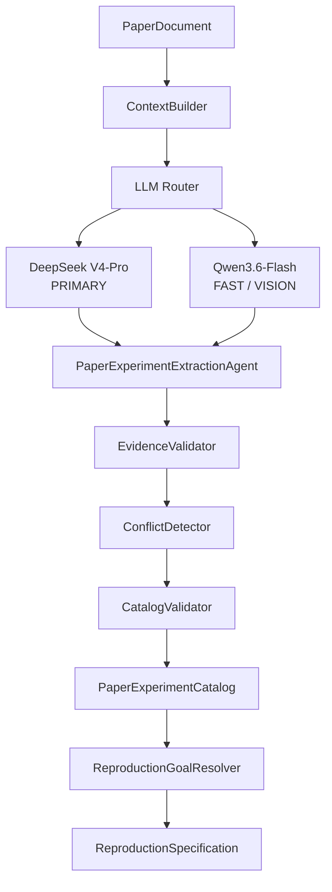

# 论文实验智能理解与抽取

Task 05 在 `PaperDocument` 与 `ReproductionSpecification` 之间建立最终产品边界：后续模块只读取经过证据校验的 `PaperExperimentCatalog`，不会直接依赖 Docling、PDF layout 或 provider response。



## 固定的模型角色

Agent 与模型相互独立。`PaperExperimentExtractionAgent` 是真正的 Agent：它控制有界 workflow、上下文、阶段顺序、repair、合并和验证，但没有 shell、文件修改、网络工具或 Docker 权限。

`LLMRouter` 的策略固定且可审计：

- `PRIMARY` → DeepSeek `deepseek-v4-pro`，负责科研语义、实验关系、设置、冲突与 Figure 的最终意义；
- `FAST` → Model Studio `qwen3.6-flash`，负责 context relevance、格式/schema repair 和轻量 review；
- `VISION` → 同一个 `qwen3.6-flash`，只做结构化视觉观察，不形成第二份 Catalog。

`StructuredLLMClient.generate_structured()` 接收 role、system prompt、untrusted content、Pydantic output schema、可选 images 和 call settings。返回已验证对象及 `LLMCallMetadata`；provider 原始 response、Authorization header 和 API key 不进入领域模型或 trace。DeepSeek/Qwen adapters 使用各自 OpenAI-compatible Chat Completions JSON mode、timeout、有限 retry 和 usage 数据。API key 仅从 `DEEPSEEK_API_KEY`、`DASHSCOPE_API_KEY` 读取。

## Catalog 结构

`PaperExperimentCatalog` 表达一篇论文的完整实验理解：

- paper/document identity；
- datasets 与 model variants（canonical name、aliases、evidence）；
- main、baseline、ablation、sensitivity、robustness、efficiency、other experiments；
- training/evaluation `ReproductionParameter`；
-复用 Task 03 `PaperClaim`；
- evidence、FigureObservation、conflicts；
- COMPLETE/PARTIAL 状态和 extraction metadata。

`PaperExperimentRecord` 包含稳定 experiment ID、名称、类型、dataset、model、variant、parent experiment、conditions、parameters、claims、evidence，以及 source sections/tables/figures。它不含 command、entrypoint、repository、requirements、Docker 或 GPU 信息。

## ContextBuilder 与分阶段 workflow

ContextBuilder 使用 heading、正文、table/figure caption、reading order 和中英文科研关键词先做确定性候选筛选。候选超过阈值时才调用 FAST 分类；分类结果只决定 context，不作为论文事实，而且必须一一对应输入 locator。不会无条件把全文发送给 PRIMARY。

Agent 依次处理：overview、dataset/model、training/evaluation、main/baseline、ablation/sensitivity/robustness/efficiency、claims、必要的 Figure observation/interpretation，最后 merge、deterministic validation 和 FAST catalog review。每一阶段使用 `StageExtraction` JSON schema，不对自然语言结果做 regex 解析。

Prompt 位于 `backend/app/agents/paper/prompts/`。每个文件包含 NAME、VERSION、SYSTEM 与 TASK；当前 `v1` 是 prompt 版本，不是临时产品版本。Trace 记录 prompt name/version 和每次 call metadata。

## 不可信内容与证据

论文正文、表格、caption、图片文字都标记为 `UNTRUSTED DATA`。Prompt 明确禁止它们改变 system instructions、模型角色、schema、工具、配置、文件、网络或 workflow。Agent 本身没有可被诱导调用的执行工具。

`EvidenceValidator` 确认 document/source identity，以及 page、block、section、table、row、column、figure 是否真实存在；对 evidence text 使用 normalized containment/token overlap。PaperClaim 的数值还必须能在 evidence 内容中找到（同时支持 0.7533 与 75.33 的比例表示）；EXPLICIT parameter 的值也必须出现在证据中。无效证据不能进入最终 Catalog。

## Table 与 Figure

结构化表格先确定性遍历 headers/rows，把 numeric cell 转为 `TableFact`，保留原始 row/column locator。PRIMARY 只解释 proposed model、baseline、full model、dataset 和 ablation 关系，不重新抄数字。

Figure 仅在 caption/context 表明 performance plot、sensitivity、training curve、qualitative comparison 或 ablation 且文本不足时进入视觉路径：

```text
FigureBlock → Qwen VISION → FigureObservation → DeepSeek PRIMARY → Catalog
```

Qwen 记录看见的 labels、可靠 metrics/trends 和 uncertainties。不可读数字必须为 null/UNKNOWN；FigureObservation 本身不会自动成为 `PaperClaim`。

## Conflict、repair 和验证

相同 experiment/metric/dataset/split/condition 出现不同值时，`ExtractionConflict` 保存所有 candidate values 与 evidence，默认 `UNRESOLVED`。同值重复会合并 evidence；不同值不会静默覆盖。

Repair 有严格上限：原 PRIMARY 失败后先由 FAST 修复格式、schema 或简单 evidence；仍不通过时升级 PRIMARY 修复科研语义。耗尽后记录 missing component，Catalog 为 PARTIAL；只要没有处理失败，论文未报告的 UNKNOWN parameter 可以存在于 COMPLETE Catalog。完全没有可用实验则抛出 `PaperExtractionError`，不返回 FAILED 空 Catalog。

CatalogMerger 使用规范化字符串和显式 aliases 合并 dataset/model entity，保守去重 experiment、claim、parameter 和 evidence。CatalogValidator 再检查 experiment ID、dataset aliases、ablation parent、claim target、source references、locator、evidence text/value 和 dangling references。

## Goal Resolver

`ReproductionGoalResolver` 优先按 table、dataset/alias、experiment type、model/variant、metric 和 ablation 做确定性匹配。复杂、无法确定的自然语言可以交给 PRIMARY，但返回 ID 必须属于 Catalog。输出支持 RESOLVED、AMBIGUOUS 和 NOT_FOUND；AMBIGUOUS 提供候选和澄清问题，不随机选择。

边界保持为：

```text
PaperDocument → PaperExperimentCatalog → ReproductionSpecification
→ future RepositoryAnalysis → Paper-Code Alignment
→ Reproduction Planner → ExperimentSpecification
```

## DMSF 示例

文档示例（不是 production hardcode）：MVSA-S 上的 DMSF Full Model 是 MAIN experiment，Table 2 声明 Accuracy=0.7533、F1=0.7531；`w/o Center Loss` 是指向 Full Model 的 ABLATION record。每个值都携带 `table:2/row:DMSF/column:Accuracy` 一类稳定 locator。

## 真实 API 验证

真实 DeepSeek/Qwen 验证不随生产源码仓库分发，应在隔离环境中显式运行并通过环境变量注入 API key。Trace、异常和验证输出都不得保存 secret。

本 Task 不实现 Repository Analyzer、Git clone/index、Paper-Code Alignment、Planner、ExperimentSpecification generation、Curie integration、Docker、GPU Scheduler、数据库、队列、FastAPI、React 或 Result Comparator。
