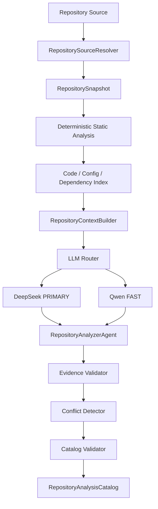

# 仓库静态智能分析

Task 06 将本地目录或 HTTPS Git 仓库转换为可审计的 `RepositoryAnalysisCatalog`。分析器严格只读：读取、解析、索引，并让 LLM 对选定文本做结构化推理；它不会导入仓库模块、执行脚本、安装依赖、构建 Docker 镜像或访问数据集与模型地址。

## 核心对象

- `RepositoryReference`：来源、请求的 branch/tag/commit、凭据引用和 submodule 策略。模型不保存 token、密码或 Authorization header。
- `RepositorySnapshot` / `RepositoryFile`：解析后的提交 SHA、内容哈希、相对路径、语言、角色、大小、文本/二进制、generated/vendor 状态、submodule 与 LFS pointer。文件全文不进入 Catalog。
- `CodeSymbol` / `CodeIndex`：函数、类、方法及位置；Python 使用 AST，Java、Go、C/C++、JavaScript、TypeScript 使用离线 Tree-sitter grammar。
- `RepositoryExperimentImplementation`：仓库自身声明或静态上下文支持的入口、配置、数据集、模型、参数和命令关系；不表达论文实验映射。
- `RepositoryAnalysisCatalog`：固定快照的结构、依赖、配置、入口、数据集、模型/损失、消融机制、指标、checkpoint/artifact、命令、证据、冲突、unknown 与 trace 元数据。

## 安全解析与固定提交

远程解析器仅接受无内嵌凭据的 HTTPS URL，拒绝 localhost 和解析到非公网地址的主机；Git 始终通过参数数组调用，关闭交互、重定向、file protocol、submodule recursion 与 LFS smudge。它执行 shallow fetch，将 `FETCH_HEAD` 解析成 40 位 SHA，再通过受路径遍历、链接和解包大小限制的 archive 落盘。失败会清理临时目录。

本地干净 Git 工作树记录 HEAD SHA；非 Git 或有未提交/未跟踪变化的目录记录 `WORKTREE`，同时由 snapshot content hash 固定实际分析内容。`.gitmodules` 默认只记录、不递归下载。LFS pointer 只记录 path、OID、size 和类型，不下载对象。

默认忽略 `.git`、虚拟环境、依赖目录、构建输出、checkpoint/output/log/WandB 目录，并叠加 `.gitignore`、单文件大小、仓库总大小、二进制和 generated/vendor 规则。名为 `datasets` 的 Python 源码包仍可索引；数据文件依靠类型、大小与上下文上限阻断进入提示词。

## 分析流程

`RepositoryContextBuilder` 按 repository map → candidate files → symbols → bounded source chunks 选择上下文。大型候选集才调用 FAST 分类；PRIMARY 分七个有界阶段理解跨文件关系。所有响应均为 Pydantic structured output，失败先由 FAST 修复，再按设置重试 PRIMARY。prompt 位于 `agents/repository/prompts` 并独立版本化，系统指令明确把 README、注释和源码视为不可信数据。

静态分析还会把具有明确置零语义的 CLI loss coefficient，以及显式 enable/disable action，提取为带 `application`、`argument_name`、`entrypoint_id`、`default_value` 和 `disable_value` 的 ablation mechanism。Stage analysis `v2` 可以在不改变 code-facing name 的前提下补充有代码证据的 semantic aliases；alias 不能为了匹配论文而凭空生成。

## 证据、冲突与状态

稳定 locator 为 `file:path#Lx-Ly`、`symbol:path::name`、`config:path::key`、`manifest:path::dependency`、`script:path`。`RepositoryEvidenceValidator` 确认文件、行、符号、配置键、依赖项和证据文本真实存在。README 命令与实际文件、依赖版本和竞争入口不一致时保留全部 candidate，不静默选边。

缺失信息使用 `UNKNOWN`；只有存在明确静态依据时才可标为 `INFERRED`，并携带 evidence/confidence。仓库本来没有 Dockerfile 等组件不构成 `PARTIAL`；只有本应处理的分析阶段实际失败才是 `PARTIAL`。无法建立或验证基础 Catalog 时抛出分析错误，对应 `FAILED`，而不是返回不可用 Catalog。

后续恢复测试时，普通单元测试必须完全离线；真实远程 Git 验证必须显式 opt-in。
